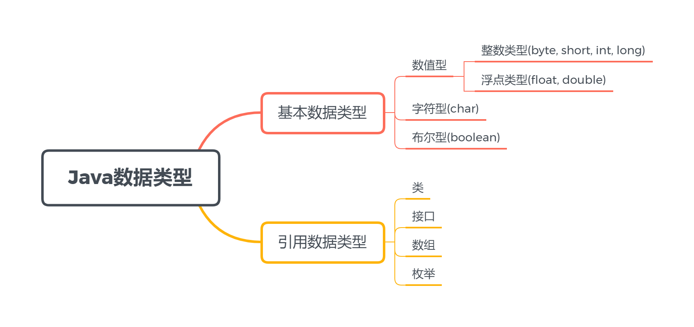
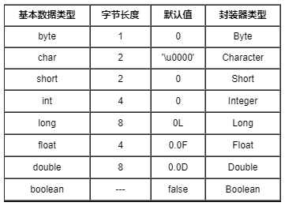

所谓的数据类型是用来指定内存中数据信息的一种标志，在Java中数据类型分为两大类：基本数据类型和引用类型。
<!-- more -->
<!--  -->


********************************************************************************
## 1.基本数据类型
基本数据类型是Java内置的数据类型，我们可以直接使用。基本数据类型包括数值型、字符型和布尔型三大类。



**NOTE:**
> Java由于虚拟机的关系，屏蔽了大小端问题，数据类型的字节长度也是固定的，和平台是32位/64位无关。

### 1.1 基本数据类型之间的转换
一种类型的数据赋值给另一种数据类型是很常见的。在Java中除了boolean类型不能与其他类型进行转换外，其他七种基本类型之间都可以进行转换。类型转换分为**自动转换**和**强制转换**：
- 自动类型转换：自动转化时发生扩宽。因为较大的数据类型保存较小的数据类型，其内存总是足够的，不需要强制转换。
- 强制类型转换：把大的转换成小的，必须显式地使数值适应更小的类型。对于double转long或者float转int这种浮点型转换为整型的时候，会发生截尾，即去除小数部分，数据丢失了精度，也必须进行强制转换。

**NOTE:**
> - byte->char的实际转换过程是byte->int->char。
> - 两个byte类型的变量进行算术运算后得到的是一个int类型的变量。
> - 初始化变量时，`0`默认是int类型，`0.0`默认是double类型。long和float需要通过加后缀进行显式指定，如`0L`或`0F`。

### 1.2 数据类型的比较
Java中内置的数值类型进行比较运算时，如果运算符两边的数值类型不同，则首先会进行类型升级，即：
- 任意一方为double，则另一方转换为double；
- 否则，若任意一方为float，则另一方转换为float；
- 否则，若任意一方为long，则另一方转换为long；
- 否则，都转换为int。

在上述规则下，数据的转换会发生**舍入误差**，通过`==`或`!=`这样的操作符来进行浮点数的比较是不可靠的，即会导致`0.1 == 0.1F`的比较结果会是`false`。对浮点数进行比较我们可以采用以下两种方式：
- 指定误差范围阈值，使用`Math.abs()`计算两者的差值，然后和阈值进行比较，小于阈值认为相等；
- `BigDecimal`能够精确的表示十进制，可以通过传入浮点数构造`BigDecimal`对象，然后调用`compareTo`方法来进行比较。

**NOTE：**
> - `BigDecimal`创建的是对象，只能调用其对应的方法进行算术运算；
> - 通常推荐使用`BigDecimal(String)`来构造浮点数据的对象，这是因为`BigDecimal(double)`结果有一定的不可预知性，如过一定要使用double，也要转换成String，然后通过`valueOf`获取结果。

### 1.3 基本类型的装箱和拆箱
在Java编程的思想中，一切都是对象。为此，Java为基本数据类型提供了包装类，将基本类型转换成包装类对象的操作叫做**装箱**，而将包装类对象转换成基本数据类型的操作叫做**拆箱**。在八种包装类型中，每一种包装类都提供了两个方法：
- `valueOf(param)`：这是一个类方法，将给定的基本类型转换成对应的包装类型。
- `xxxValue()`：实例方法，将具体的包装类型对象转换成基本类型。

#### 1.3.1 自动装箱和自动拆箱
在Java5之后，Java编译器提供了一颗语法糖：**自动装箱**和**自动拆箱**。我们可以直接将基本数据类型赋值给相应的包装类对象，也可以把一个包装器对象直接赋值给相应的基本数据类型。
#### 1.3.2 包装类型的比较
- 大小比较建议用包装类的类方法`compare(type x, type y)`；
- 相等比较建议用包装类的实例方法`equals()`。
> 由于-128~127范围内的数比较常用，所以包装类在静态初始化代码中创建了一块缓存，如果通过自动装箱并且数据在范围内得到的包装类对象会存储在缓存中。如果数据超出这个范围，就相当于创建了两个不同的对象，`==`操作符比较的是两个对象的地址是否相同，那么就会存在以下状况。
> ```
> Integer a = 127;
> Integer b = 127;
> System.out.println(a==b); // true
> 
> Integer c = 128;
> Integer d = 128;
> System.out.println(c==d); // false
> ```

********************************************************************************
## 2.引用数据类型
Java提供了8中基本数据类型，这些数据类型都不是对象，相应的变量被声明后就会在**栈**上为其分配内存空间。除基本类型外的所有数据类型，都是引用类型。当引用类型被声明时，会在栈上为引用变量分配一个内存用来存储地址，这个地址指向数据实际存储的内存。
Java的引用分为四种级别，使得程序能够灵活控制对象的声明周期，这四种级别引用分别是：**强引用**、**软引用**、**弱引用**和**虚引用**。

// TODO